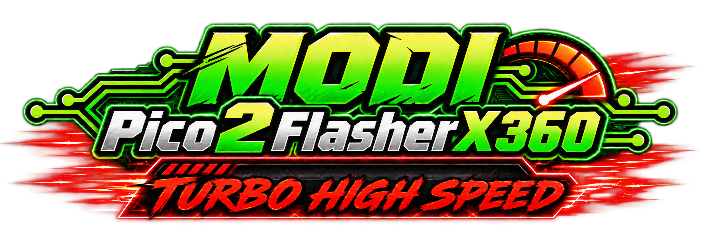
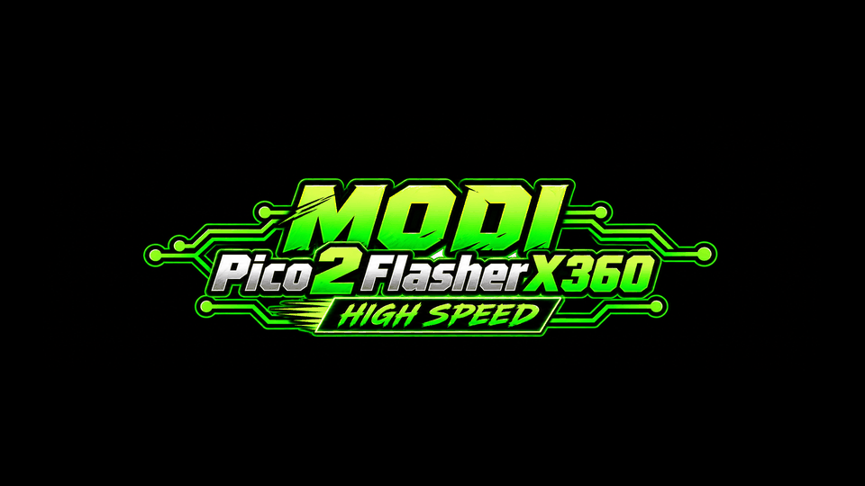

# MODI Pico 2 Flasher X360 TURBO

[🇵🇱 Polski](README_PL.md) · **🇬🇧 English**

> **High-Speed Xbox 360 NAND & eMMC Service Tool**  
> Low-cost RP2350 hardware · J-Runner with Extras integration · repair-first community project

> **RELEASE STATUS:** project media and 0.9.0 Beta candidate hashes have been added. Binaries are staged in a draft GitHub Release; final hardware QA of the exact installer-generated build and a genuine screenshot remain pending.

Video: [High Speed → TURBO (1080p)](assets/video/high-speed-to-turbo-1080p.mp4)

---

## What is MODI Pico 2 Flasher X360 TURBO?

MODI Pico 2 Flasher X360 TURBO is an independent community project built around an inexpensive **RP2350 / Pico 2-class board** for fast Xbox 360 NAND and eMMC service work.

When Xbox 360 RGH servicing began, reading and writing NAND could take tens of minutes with early interfaces such as LPT. USB programmers changed that dramatically. Today, inexpensive high-performance microcontrollers make it possible to rethink the workflow again.

This project started with one question: **how far can a low-cost RP2350 board be pushed while keeping reliable, byte-for-byte verified flashing?**

I learned from the Xbox 360 repair and modding community when I was beginning as a repair technician. After years of hardware servicing and diagnostics, this project is my way of giving something back: practical tools, documentation and knowledge that help people repair hardware instead of throwing it away.

## Verified hardware results

| Memory / tested range | READ | WRITE |
|---|---:|---:|
| 16 MB NAND | ~19 s | ~24 s |
| Jasper Big Block — tested 64 MiB + spare range | 76.890–76.955 s | 90.171 s |
| Corona eMMC — tested 48 MiB range | 56.198–57.792 s | 48.310 s |

**Measured on tested hardware. Actual performance can vary depending on motherboard, wiring quality, USB host and system configuration.** These are hardware results from MODI Flasher testing, not installer benchmarks.

We currently describe MODI as **one of the fastest low-cost Xbox 360 flashing solutions we have tested**. A broader public comparison will be required before making any absolute “world’s fastest” claim.

## Why repair-first?

The primary purpose of this tool is **hardware service, backup, recovery and repair**. A damaged or corrupted NAND/eMMC can make a console impossible to repair without the correct hardware tools.

**Right to Repair:** we support the principle that owners and independent technicians should have practical access to tools and technical knowledge needed to diagnose, maintain and repair their hardware.

The project is not an official Microsoft/Xbox product. Users are responsible for how they use the tool and for compliance with applicable law.

## Low-cost hardware

The project targets inexpensive Pico 2 / RP2350-class development boards. The core board can often be found for roughly **USD $5–6**, depending on supplier and region. This refers to the **development board only** and does not include wiring, adapters, shipping or accessories.

## Quick start

1. Download the **MODI Pico 2 TURBO UF2** from the matching GitHub Release.
2. Put the Pico 2 / supported RP2350 board into **BOOTSEL** mode and copy the UF2 to the exposed drive.
3. Wire the flasher to the supported Xbox 360 NAND/eMMC points for your motherboard.
4. Download and run **MODI-Setup.exe**.
5. Point MODI Setup at a supported **J-Runner with Extras 3.4.0.7** installation.
6. MODI Setup builds `JRunner.MODI.exe` locally and leaves the original `JRunner.exe` unchanged.
7. Connect MODI Pico 2 Flasher X360 TURBO.
8. **READ → BACKUP → COMPARE/VERIFY before any WRITE.**

Detailed guide: [Installation](docs/INSTALL.md) · [Polski](docs/INSTALL_PL.md)

## Downloads

Public releases should contain only the files an end user needs:

- `MODI-Setup.exe`
- `MODI-Pico2-Flasher-X360-TURBO.uf2`
- `SHA256SUMS.txt`
- documentation / release notes
- corresponding firmware source or a clear GPL-compliant link to it

**Do not publish the full modified J-Runner tree, development workspace, private dumps, CPU keys, caches, SDK, NuGet cache or third-party DLLs with unclear redistribution rights.**

## J-Runner integration

MODI integration adds device recognition, a MODI information panel, separate READ / WRITE / VERIFY timing, correct NAND/eMMC operation labeling, and connection cleanup/re-detection while preserving standard J-Runner workflows.

The integration is an **independent community integration** and is not an official J-Runner with Extras feature.

Future goal: after broader hardware testing, we would be happy to propose optional native MODI Pico 2 support upstream. Acceptance is entirely up to the upstream maintainers.

## MODI FLASHSHIP — What's Next

| Feature | Status |
|---|---|
| Audio / Sonus | 🔜 **COMING SOON** — hardware testing in progress |
| DirtyJTAG / glitch-chip programmer | 💡 **PLANNED** |
| UART / COM monitor | 💡 **PLANNED** |
| HANA diagnostics | 🔬 **RESEARCH** |
| Native upstream J-Runner support | 🧩 **PROPOSED** |

Roadmap details: [MODI FLASHSHIP](docs/FLASHSHIP.md) · [Polski](docs/FLASHSHIP_PL.md)

## Credits

This project exists because of years of work by the Xbox 360 service and homebrew community.

Special thanks to:

- **Team Jungle** and **Team Xecuter** — original J-Runner / Xbox 360 tooling heritage.
- **Octal450** — J-Runner with Extras and years of continued development.
- **J-Runner-With-Extras organization and all contributors**, including recent/current development contributors such as **Mitchell Waite / mitchellwaite**.
- **Pheeeeenom / Mena** — contribution to the current J-Runner with Extras release/distribution ecosystem.
- **Balázs Triszka / balika011** — original PicoFlasher work.
- **X360Tools contributors** — continued PicoFlasher development.
- Everyone who documented Xbox 360 repair, NAND, eMMC, RGH/JTAG and board-level service knowledge over the years.

MODI integration / project: **MODI Diagnostic Lab · Modyfikator89**.

Full acknowledgements: [CREDITS.md](CREDITS.md)

## Licensing and source availability

Original third-party license texts must remain unchanged. Polish translations, where provided, are informational convenience translations only.

The MODI firmware is derived from GPL-licensed PicoFlasher work. A distributed modified UF2 must therefore have its corresponding source available in a GPL-compliant form. The main release repository should stay clean; firmware source may live in a dedicated source repository or matching source archive and must be linked clearly from each release.

See: [THIRD-PARTY-NOTICES.md](THIRD-PARTY-NOTICES.md)

## Independent project / disclaimer

**Independent fan-made community project.** MODI Pico 2 Flasher X360 TURBO and MODI Diagnostic Lab are not affiliated with, sponsored by, endorsed by or approved by Microsoft or Xbox. Xbox and related names/trademarks belong to their respective owners and are used only to identify compatible hardware and document technical/service procedures.

Full disclaimer: [DISCLAIMER.md](DISCLAIMER.md)

## Package status and firmware source

[Release status and hashes](docs/RELEASE_STATUS.md) · [Corresponding firmware source](docs/FIRMWARE_SOURCE.md)
