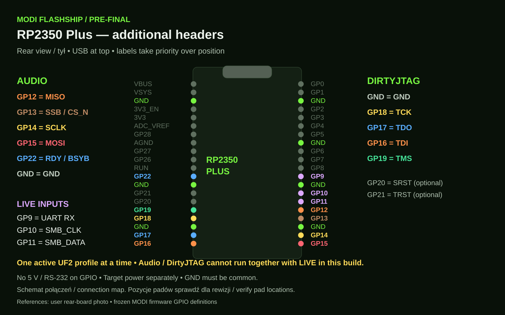
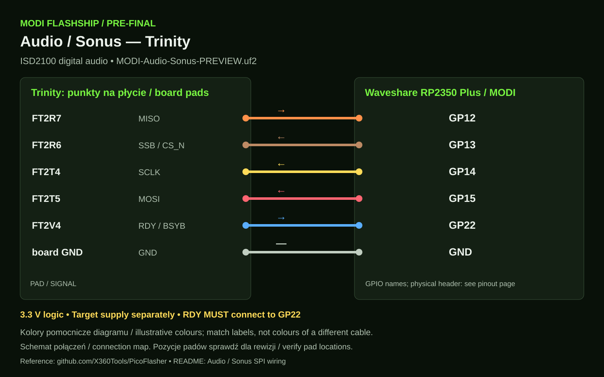
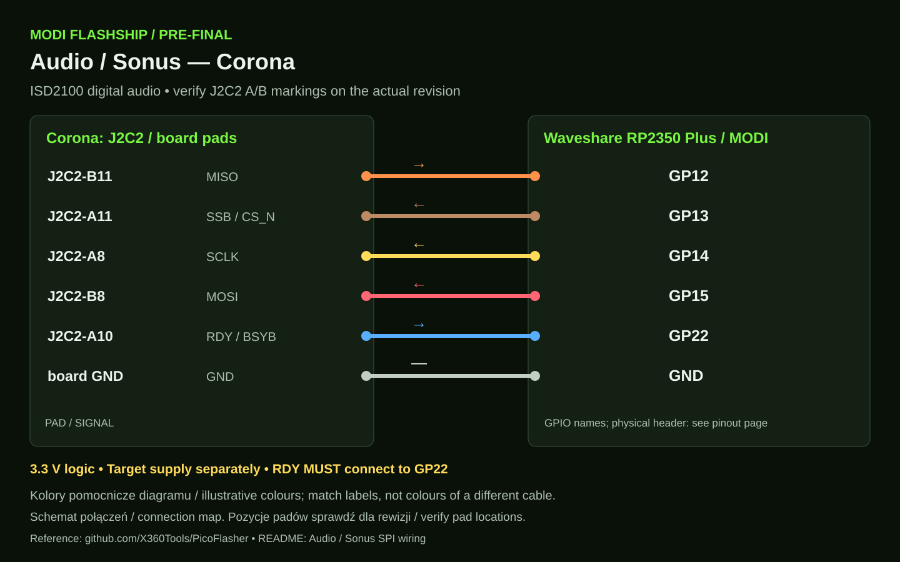
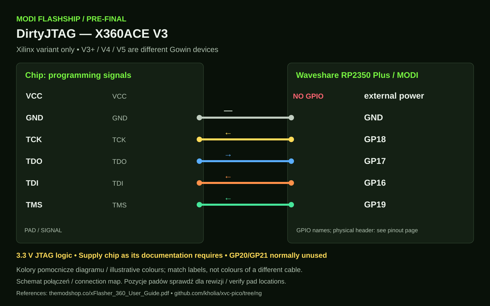
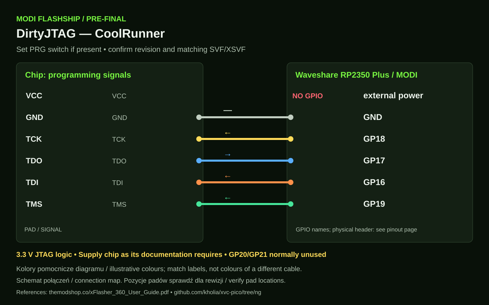
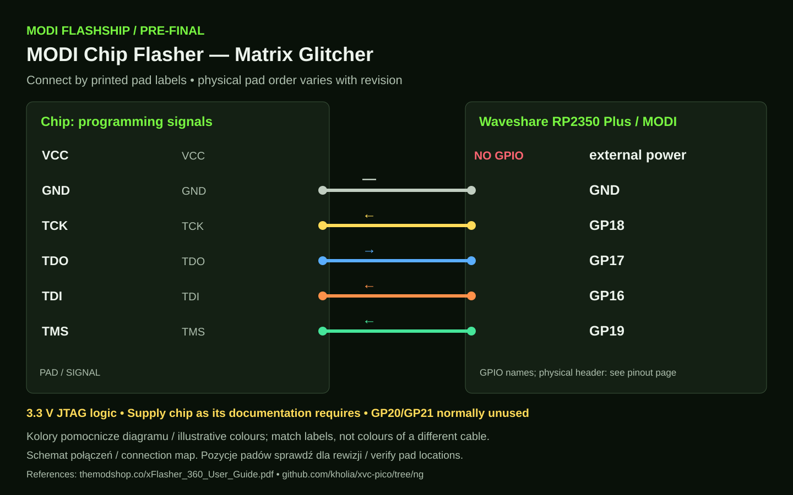
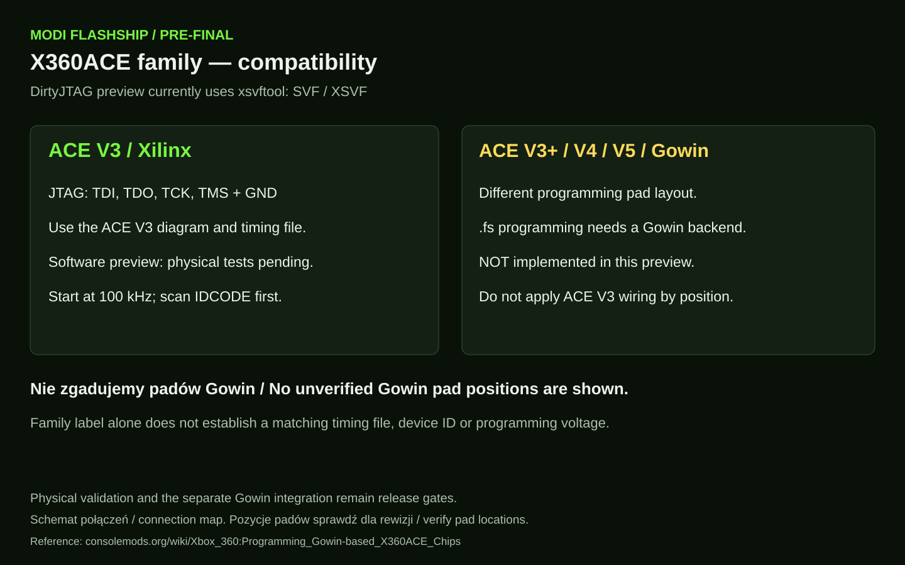

# MODI Audio and DirtyJTAG wiring

[Polski](FLASHSHIP_WIRING_PL.md) · [Pre-final status](PRE_FINAL.md) · [NAND and eMMC](WIRING.md)

These connections belong to the new preview profiles. Audio, DirtyJTAG and LIVE require physical hardware validation. One Pico runs one active UF2 profile in this build. Restore the tested TURBO profile for NAND/eMMC.

Diagram colours are illustrative and do not specify the existing NAND GP0–GP5 cable colours. Connection maps use signal and pad names; they do not represent physical pad distances or every board revision. Check your board labels before soldering.

## RP2350 Plus header

Rear view, USB at the top. Audio uses GP12–GP15 plus GP22. DirtyJTAG uses GP16–GP19; GP20/GP21 are optional resets. LIVE uses GP9–GP11 as inputs. Common ground and 3.3 V logic are required. Do not connect 5 V or RS-232 to GPIO. Power the target according to its documentation.

## Trinity and Corona Audio Sonus

`MODI-Audio-Sonus-PREVIEW.uf2` targets digital ISD2100 devices, not the analog 5 V ISD1200 family.

| Signal | MODI GPIO | Trinity | Corona |
|---|---|---|---|
| MISO | GP12 | FT2R7 | J2C2-B11 |
| SSB / CS_N | GP13 | FT2R6 | J2C2-A11 |
| SCLK | GP14 | FT2T4 | J2C2-A8 |
| MOSI | GP15 | FT2T5 | J2C2-B8 |
| RDY / BSYB | **GP22** | FT2V4 | J2C2-A10 |
| GND | GND | verified board ground | verified board ground |

**MODI RDY is GP22.** The original X360Tools table uses GP11; MODI reserves GP11 for passive SMB_DATA capture.

Console pad names come from the [PicoFlasher author's Audio/Sonus table](https://github.com/X360Tools/PicoFlasher/blob/master/README.md); GP22 follows our firmware. Before the first write, obtain and preserve two matching full Audio backups. PLAY depends on the voice indexes in the image.

## DirtyJTAG glitch chip programming

`MODI-DirtyJTAG-PREVIEW.uf2` uses the user's existing `xsvftool-dirtyjtag.exe` installation for SVF/XSVF. Start at 100 kHz and obtain a stable IDCODE. Use timing files for the exact model and revision.

| MODI GPIO | Target signal | Direction |
|---|---|---|
| GP16 | TDI | Pico → chip |
| GP17 | TDO | chip → Pico |
| GP18 | TCK | Pico → chip |
| GP19 | TMS | Pico → chip |
| GND | GND | common ground |
| GP20 | SRST | only when required |
| GP21 | TRST | only when required |

VCC is not a GPIO pin. Supply chip power separately as its instructions require. Do not transfer physical pad order between revisions.

### X360ACE V3

### CoolRunner

Select PRG on variants with a programming switch.

### Matrix Glitcher

Use printed TDI/TDO/TCK/TMS/GND labels. The diagram does not establish one physical pad order for all Matrix revisions.

### ACE family and Gowin

ACE V3 Xilinx and ACE V3+ / V4 / V5 Gowin need different programming paths. Gowin `.fs` programming is **not implemented** in this preview. Do not apply ACE V3 pad positions to Gowin. References: [Gowin ACE instructions](https://consolemods.org/wiki/Xbox_360:Programming_Gowin-based_X360ACE_Chips), [xFlasher 360 User Guide](https://themodshop.co/xFlasher_360_User_Guide.pdf), [xvc-pico developer](https://github.com/kholia/xvc-pico/tree/ng).

## Printable diagrams

[Audio and DirtyJTAG PDF](../assets/wiring/MODI-AUDIO-DIRTYJTAG-WIRING.pdf). SVGs remain sharp when enlarged. These are MODI technical connection maps, not photographs of a particular chip revision.
