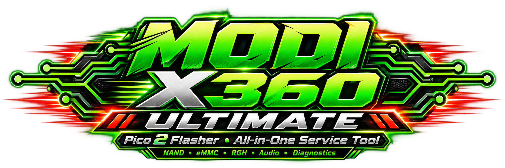

# MODI X360 ULTIMATE — All-in-One Xbox 360 Service Tool

[Polski](ULTIMATE_PL.md) · [TURBO](https://github.com/modyfikatorcasper/modi-pico2-flasher-x360-turbo/releases/tag/v0.9.1-beta) · [Alpha](ALPHA.md)

**ULTIMATE PREVIEW / IN DEVELOPMENT**

TURBO remains the tested flashing module. ULTIMATE expands it into a target service platform: backup, RGH, CPU Key, Audio/Sonus, glitch-chip programming, LIVE and memory conversions.

**ONE DEVICE. ONE HEADER. ONE SOFTWARE. FULL XBOX 360 SERVICE WORKFLOW.**

One device, one target service header, one application and successive service modes. Operations do not all run concurrently. The existing NAND GP0–GP5 header does not contain the additional Audio/JTAG/LIVE pins; the shared header must expose them according to the pin map.

**Current state:** one Pico runs one UF2 profile. Audio, MODI Chip Flasher, UART and LIVE are separate builds. LIVE can receive UART and SMBus concurrently; this does not combine all flashing modes. Automatic mode switching in one firmware and one shared application are development goals.

## Modules and status

| Module | Status | Scope |
|---|---|---|
| TURBO NAND / eMMC | **TESTED** | Tested NAND/eMMC ranges. Binary bytes and timings unchanged. |
| Audio / Sonus | **PREVIEW · HARDWARE VALIDATION PENDING** | Digital ISD2100. MODI RDY = GP22. |
| UART / COM Monitor | **PREVIEW · HARDWARE VALIDATION PENDING** | Live receive, logs and spoken notifications. |
| XeLL CPU Key Assistant | **PREVIEW** | Current LAN panel; target UART/LIVE key capture is in development. |
| HANA / SMBus LIVE Monitor | **PREVIEW · HARDWARE VALIDATION PENDING** | Passive SMBus capture. Full HDMI diagnostics need separate validation. |
| Automatic RGH Assistant | **IN DEVELOPMENT** | Planned single workflow with two backups and final readback. |
| Memory Conversions | **IN DEVELOPMENT** | Planned images for physical memory replacement with 16 MB NAND. |
| Xbox 360 DVD Remarry | **RESEARCH** | Future research module; no remarry function in current firmware. |

## Automatic RGH Assistant — IN DEVELOPMENT

`CONNECT → READ #1 → READ #2 → COMPARE → CREATE XeLL → WRITE XeLL → BOOT → CAPTURE CPU KEY → BUILD IMAGE → WRITE → READBACK VERIFY → DONE`

**Target:** no TV, manual IP entry or required LAN for CPU Key capture. The application should receive the key over a supported COM/UART/LIVE channel, validate it against console data and save it locally. This is a plan, not verified support for every revision: XeLL output, baud, wiring and the key parser need validation. The XeLL LAN preview remains an alternative. SMBus/HANA activity alone does not expose the CPU Key.

## Audio / Sonus

**MODI Audio RDY = GP22. GP11 = passive SMB_DATA.** GP12 MISO, GP13 CS, GP14 CLK, GP15 MOSI, GND. [Wiring](FLASHSHIP_WIRING.md). Digital ISD2100; analog ISD1200 5 V is not supported.

## HANA / SMBus LIVE Monitor

The current module is **HANA / SMBus LIVE Monitor**. A target panel may report NO ACTIVITY, SMBus ACTIVITY, HANA ACTIVITY DETECTED or BOOT STAGE REACHED only after the interpretation rules are validated. Passive bus data does not prove video, HDCP, HDMI or HANA health.

## ULTIMATE MEMORY CONVERSIONS — IN DEVELOPMENT

[Full conversion plan and revisions](CONVERSIONS.md)

## UI concept

The screen concept on the website is not a working application. CONSOLE DETECTED should appear only after real detection. Large modes: BACKUP / RESTORE, AUTOMATIC RGH, MEMORY CONVERSION, GLITCH CHIP PROGRAMMER, AUDIO / SONUS, LIVE MONITOR, HANA DIAGNOSTICS and RECOVERY. Revision/geometry detection should reduce manual settings; ambiguous data stops writing. HANA DIAGNOSTICS is a target UI name, not a full HDMI test claim.

## Photographs and wiring

Current reference photographs are temporary; authors and notices are retained. We need original MODI photos: full Corona boards by revision, Trinity and Fat; macros of Audio, UART/SMBus and conversion pads; both sides of ACE, CoolRunner and Matrix chips; RP2350 Plus with the complete header. Target layout: **left — full board with location; centre — pad macro; right — actual Pico with GPIO**. Use short signal labels in graphics and PL/EN explanations below; phones use one column with enlargement.

[Current photo sources](PHOTO-CREDITS.md)

## Before ULTIMATE 1.0

Before 1.0: unified firmware and safe mode switching; public host updater; hardware tests for Audio (ID/backup/write/readback/play), JTAG (IDCODE/program/verify), UART and concurrent SMBus; CPU Key and full RGH validation; each conversion combination with full readback and console boot; original photos; mobile/PL/EN QA; source and license compliance. DVD Remarry remains research outside the 1.0 commitment.

Optional native upstream J-Runner support remains a proposal without implied endorsement.

