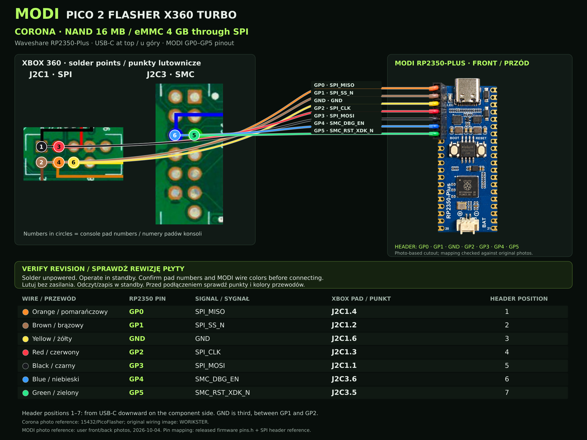
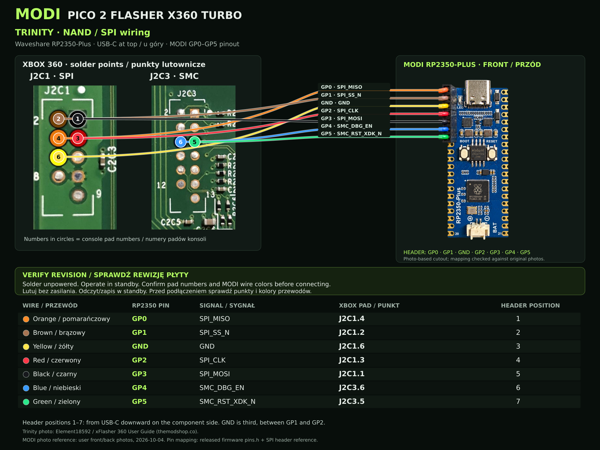
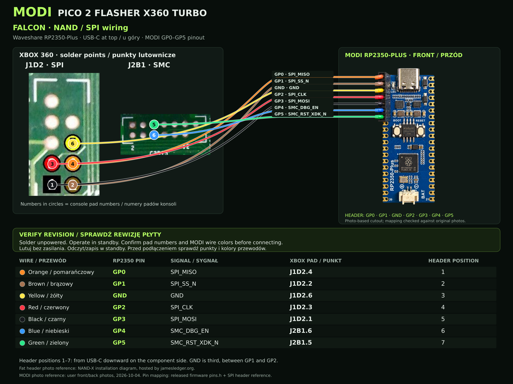

# MODI Pico 2 Flasher X360 TURBO — okablowanie / pinout

[English](WIRING.md) · [Instalacja](INSTALL_PL.md)

Diagramy dotyczą **Waveshare RP2350-Plus z headerem MODI pokazanym na zdjęciach** oraz opublikowanego firmware MODI TURBO v0.9.1. Kolory pochodzą z rzeczywistych zdjęć przodu i tyłu właściciela. Inne płytki i wiązki mogą mieć inne kolory; porównuj oznaczenia GPIO oraz sygnały.

## Pinout / Header

To piny używane przez nasz **header NAND/SPI**.

| Pozycja headera¹ | Kolor przewodu | Pin RP2350 | Sygnał | Punkt Corona / Trinity | Punkt Falcon / Fat |
|---:|---|---|---|---|---|
| 1 | Pomarańczowy | GP0 | SPI_MISO | J2C1.4 | J1D2.4 |
| 2 | Brązowy | GP1 | SPI_SS_N | J2C1.2 | J1D2.2 |
| 3 | Żółty | GND | GND | J2C1.6 | J1D2.6 |
| 4 | Czerwony | GP2 | SPI_CLK | J2C1.3 | J1D2.3 |
| 5 | Czarny | GP3 | SPI_MOSI | J2C1.1 | J1D2.1 |
| 6 | Niebieski | GP4 | SMC_DBG_EN | J2C3.6 | J2B1.6 |
| 7 | Zielony | GP5 | SMC_RST_XDK_N | J2C3.5 | J2B1.5 |

¹ Licz od strony USB w dół **siedmiopozycyjnego headera MODI ze zdjęcia**. Przy USB u góry header znajduje się **po lewej od przodu** (elementy / BOOT / RESET), a **po prawej od tyłu** (napisy GPIO).

Kolejność fizyczna: **GP0 → GP1 → GND → GP2 → GP3 → GP4 → GP5**.

**Żółty to GND. Czarny to SPI_MOSI.** Numery GPIO nie są numerami pozycji headera. Masa jest między GP1 i GP2. `J2C1.4` oznacza punkt 4 złącza J2C1, nie GPIO 4. Ustal punkt 1 z oznaczeń płyty / kwadratowego pola i zachowaj orientację ze zdjęcia; nie licz punktów według kolejności przewodów.

## Corona — J2C1 + J2C3

[Otwórz pełny diagram Corona](../assets/wiring/wiring-corona-rp2350-plus.png)

Nasza wersja MODI używa tej **drogi SPI dla Corona 16 MB NAND i Corona 4 GB eMMC**, przez interfejs pamięci konsoli. Nie korzysta ze schematu stock PicoFlasher GP6–GP9 / bezpośredniego eMMC U1D1. Nie mieszaj tych diagramów z naszym firmware. Sprawdź rewizję Corona i ciągłość przy punktach serwisowych, w tym R2C10, jeśli dotyczy; pokazany układ nie jest poleceniem mostkowania niezidentyfikowanego elementu.

## Trinity — J2C1 + J2C3

[Otwórz pełny diagram Trinity](../assets/wiring/wiring-trinity-rp2350-plus.png)

Przed lutowaniem porównaj oznaczenia J2C1 / J2C3 i orientację punktu 1.

## Falcon / Fat — J1D2 + J2B1

[Otwórz pełny diagram Falcon / Fat](../assets/wiring/wiring-falcon-rp2350-plus.png)

Tabela dotyczy połączeń Falcona J1D2 / J2B1. Zdjęcie punktów jest **referencją wspólnego układu Fat**, a nie zdjęciem niezależnie zidentyfikowanym jako Falcon. Potwierdź rewizję, oznaczenia złączy oraz punkt 1 swojej konsoli; inne płyty Fat również wymagają sprawdzenia rewizji.

## Przed podłączeniem

1. Ustal płytę i typ pamięci. Porównaj każdy kolor przewodu z oficjalnym diagramem MODI i napisami GPIO na tyle płytki.
2. Na czas lutowania odłącz zasilanie konsoli i USB programatora. Sprawdź ciągłość, numery punktów i zwarcia między sąsiednimi polami.
3. Przewody powinny być krótkie i zabezpieczone. Przy transferze konsola ma być wyłączona z zasilaczem w standby; USB programatora podłącz po kontroli przewodów.
4. Przed zapisem wykonaj dwa odczyty i porównaj je. Po zapisie zrób odczyt kontrolny i porównaj wybrany zakres.
5. Odłącz programator przed uruchomieniem konsoli.

## Źródła i autorzy zdjęć

- Zdjęcia przodu i tyłu właściciela MODI: kolejność headera i rzeczywiste kolory przewodów.
- [Źródła firmware odpowiadające v0.9.1](https://github.com/modyfikatorcasper/modi-pico2-flasher-x360-turbo/releases/download/v0.9.1-beta/MODI-Pico2-Flasher-X360-TURBO-SOURCE-v0.9.1.zip): `firmware-source/pins.h`, `xbox.c` i `emmc_fifo.c`.
- [15432/PicoFlasher](https://github.com/15432/PicoFlasher): obsługa SPI GP0–GP5 i [oryginalna referencja Corona](https://github.com/15432/PicoFlasher/blob/master/IMG_20241128_201825_526.jpg) / WORIKSTER.
- [xFlasher 360 User Guide v1.2 — Element18592](https://themodshop.co/xFlasher_360_User_Guide.pdf): tabela przewód–punkt SPI (strona 6) oraz zdjęcie płyty Trinity. Korzystamy wyłącznie z jego sekcji SPI.
- [Weekend Modder / PicoFlasher](https://weekendmodder.com/picoflasher): dodatkowa weryfikacja połączeń.
- [James Ledger — referencja Fat NAND-X](https://jamesledger.org/assets/images/jtag-2021/nandxphat-1.jpg): zdjęcie wspólnego układu punktów Fat; zachowane autorstwo oryginalnego diagramu NAND-X.
- [Schemat Falcon](https://xbox360hub.com/wp-content/uploads/2021/02/Xbox_360_Falcon_Schematic.pdf): potwierdzenie oznaczeń J1D2 / J2B1.

Zdjęcia płyt należą do wskazanych autorów. MODI dodaje nakładkę przewodów i tabele. Wstawka RP2350-Plus jest wycięciem wspomaganym przez AI na podstawie zdjęcia właściciela; przypisanie elektryczne sprawdzono na oryginalnych zdjęciach i w firmware, nie na wygenerowanych napisach. Diagramy opisują istniejącą wersję i nie są nowym testem sprzętowym.
